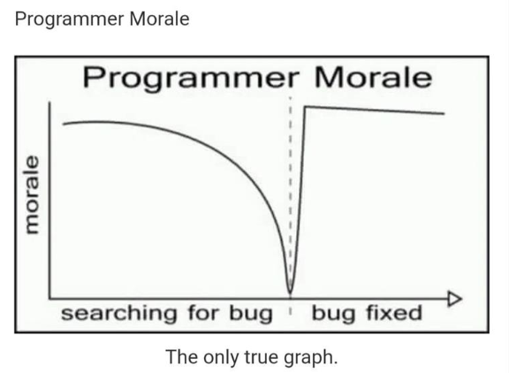

# Humour

Why do programmers always mix up Christmas and 31 Oct ? because  Octal 31 is same as Decimal 25  

    There are 10 types of people in this world. 
    
    Those who understand binary and those who don’t.

    There are two ways to write error-free programs; only the third one works.

    
    The best thing about a Boolean is even if you are wrong, you are only off by a bit.

    Debugging: Removing the needles from the haystack.

    
How do you annoy a web devloper

[https://www.hongkiat.com/blog/programming-jokes/](https://www.hongkiat.com/blog/programming-jokes/)

[https://www.idtech.com/blog/part-i-top-10-programmer-jokes-explained-for-the-rest-of-us](https://www.idtech.com/blog/part-i-top-10-programmer-jokes-explained-for-the-rest-of-us)